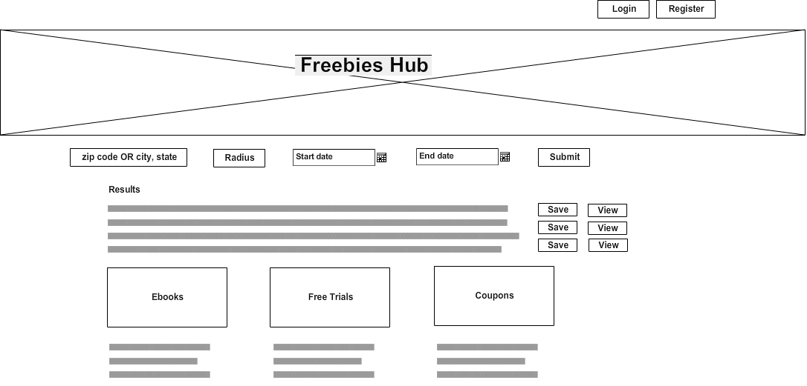
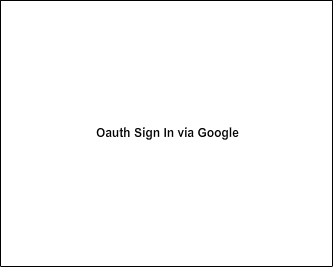
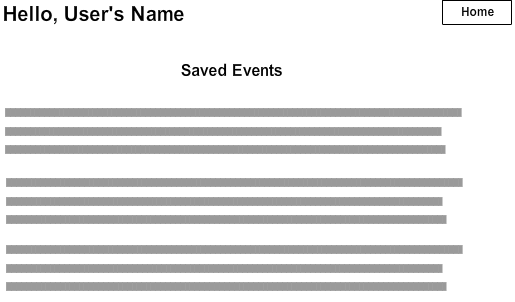
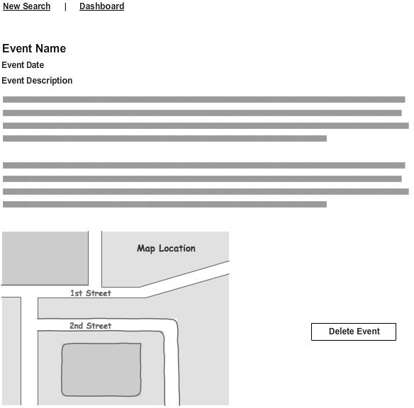

Planning
=======
# project3_freebiesPlanning
=========
Freebies Hub is a one-stop shop for a variety of free things on the internet. On Freebies Hub, users can find free events in their area, download free ebooks and coupons, and find links to free software trials. In addition, registered users can save free events to their profiles.

## see demo here: https://vast-bayou-41984.herokuapp.com/

Original Concept and Design Approach
====================================
___

___

___

___

___

Languages, Technologies, and Frameworks
======================================
Development
------------

* HTML
* CSS
* JavaScript
* jQuery

Technologies
------------
* Mongoose
* Express
* Node.js
* Mongo

Third-party API
----------------
* EventBrite

Deployment and Cloud Storage
----------
* Heroku
* Amazon S3

Deployment
----------
* Heroku

Other
------
* Trello

Next Steps
===========

Links
===========
* https://trello.com/b/MK3GXBUu/project-freebies-hub
=======

